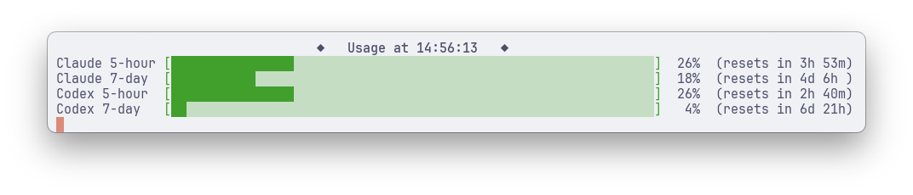

# ai-plan-usage



Terminal bars for Claude and Codex plan usage (5-hour, 7-day).

## Requirements

- macOS, `jq`, `curl`
- Claude: `claude` CLI logged in
- Codex: `codex` CLI logged in with ChatGPT (`~/.codex/auth.json`)

## Usage

```sh
./ai-plan-usage.sh --interval=600 --providers=claude,codex
```

| Flag | Default | Description |
|------|---------|-------------|
| `--providers=LIST` | `claude,codex` | Providers to show, in order |
| `--interval=N` | `600` | Seconds between refreshes |
| `--width=N` | `auto` | Bar width; `auto` fits terminal |
| `--full` | off | Print raw JSON |

## Adding a provider

- Add name to `PROVIDERS`
- `fetch_<name>`: print raw JSON, fail with message on stderr
- `rows_<name>`: JSON on stdin → `label<TAB>percent<TAB>reset` rows
